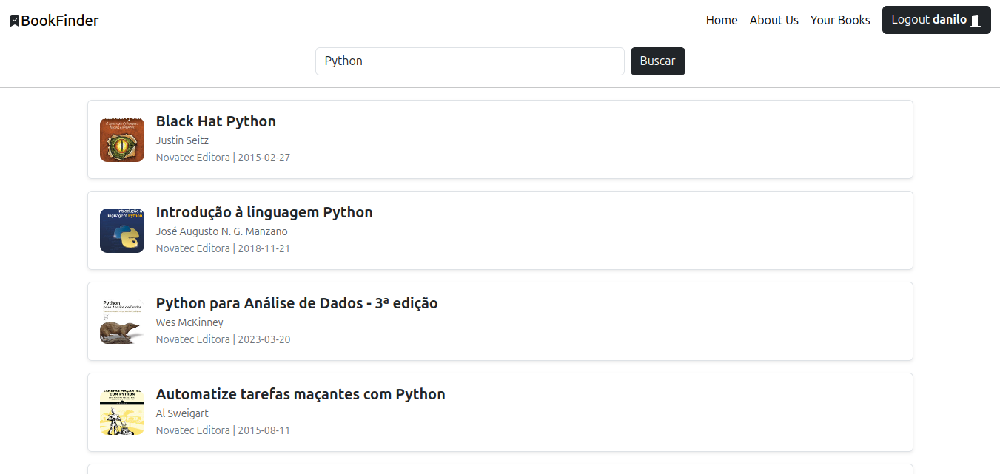

<div align="center">

#  BookFinder

[](https://choosealicense.com/licenses/mit/) [](https://www.python.org/downloads/) [](https://www.djangoproject.com/) [](https://www.postgresql.org/)

Your personal library companion - Search, discover, and manage your book collection with ease.

<br>


<p><p>


<p><p>


</div>


## Tech Stack

- **Backend Framework:** Django 4.2+
- **Database:** PostgreSQL 13+
- **Frontend:** Bootstrap 5
- **Caching:** Redis (Coming Soon)
- **Containerization:** Docker (Coming Soon)
- **Package Management:** Poetry
- **Version Control:** Git

## Installation

### Prerequisites

Before you begin, ensure you have the following installed:

- Python 3.8 or higher (managed with Pyenv)
- Poetry for dependency management
- PostgreSQL (optional for local development)
- Redis (Coming Soon)
- Docker (Coming Soon)

### Quick Start Guide

1. **Clone the Repository**
   ```bash
   git clone https://github.com/yourusername/bookfinder.git
   cd bookfinder
   ```

2. **Set Up Environment**
   ```bash
   poetry install
   ```

3. **Configure Environment Variables**
   ```bash
   cp .env.example .env
   # Edit .env with your configuration
   ```

4. **Initialize Database**
   ```bash
   poetry run python manage.py migrate
   poetry run python manage.py createsuperuser
   ```

5. **Start Development Server**
   ```bash
   poetry run python manage.py runserver
   ```

6. **Access the Application**
   - Open [http://127.0.0.1:8000/](http://127.0.0.1:8000/) in your browser
   - Admin panel: [http://127.0.0.1:8000/admin/](http://127.0.0.1:8000/admin/)

#

##  Contributing

We welcome contributions from the community! Here's how you can help:

1. Fork the repository
2. Create your feature branch (`git checkout -b feature/AmazingFeature`)
3. Commit your changes (`git commit -m 'Add some AmazingFeature'`)
4. Push to the branch (`git push origin feature/AmazingFeature`)
5. Open a Pull Request

Please read our [Contributing Guidelines](CONTRIBUTING.md) for more details.


## License

This project is licensed under the MIT License - see the [LICENSE](LICENSE) file for details.


## Support

Need help? We've got you covered:

- 📧 Email: [mouradanilo061@gmail.com](mailto:mouradanilo061@gmail.com)
- 💻 GitHub: [DaniDMoura](https://github.com/DaniDMoura)
- 🌐 Project Repository: [BookFinder on GitHub](https://github.com/DaniDMoura/bookfinder)

#

<div align="center">

Made with ❤️ by [DaniDMoura](https://github.com/DaniDMoura)

</div>